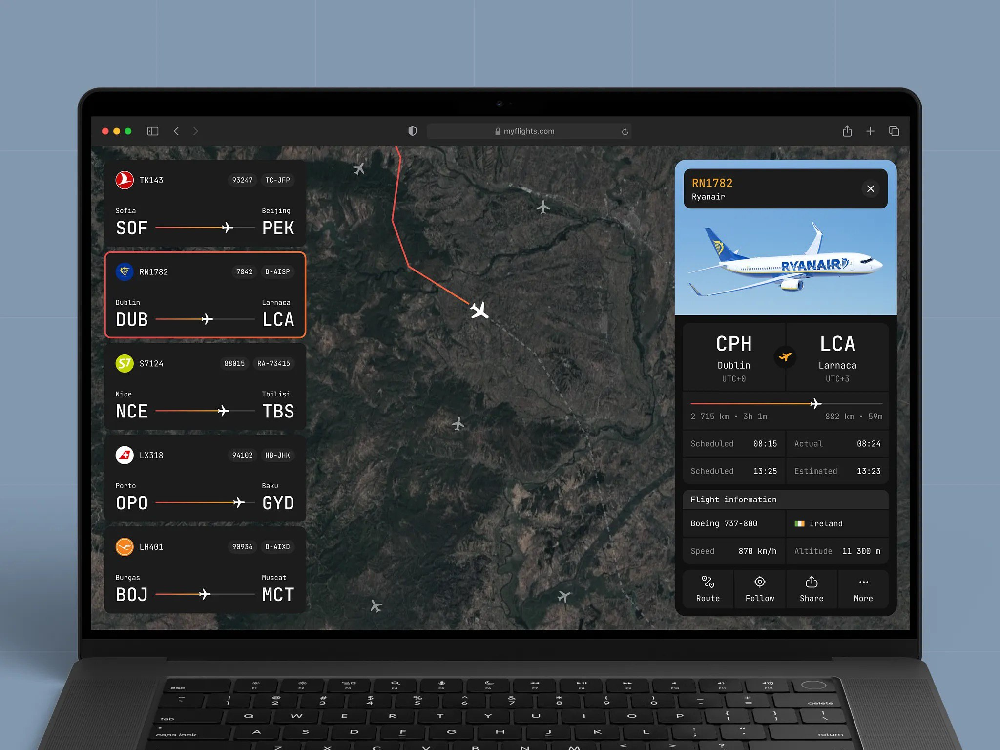

# Sky Track - Flight Tracker App

This project is a flight tracking application built with React and Vite. It allows users to view a list of flights, check detailed information about each flight, add favorites, switch between light and dark themes, filter flights, and visualize routes on a map. The app uses mock data initially and integrates with real APIs like Aviationstack or OpenSky Network for live flight data. Favorites and theme preferences are persisted using local storage.

## Features

- **Flight List**: Displays a list of flights with basic information (departure city, arrival city, flight number, airline).
- **Flight Details**: Detailed view of a selected flight, including route, time, status, speed, altitude, and country.
- **Favorites**: Users can add/remove flights to/from favorites and view them on a dedicated page.
- **Theme Switching**: Supports light and dark themes, stored in local storage.
- **Filtering**: Filter flights by departure point and airline.
- **Map Integration**: Displays flight routes on a map using MapLibre GL, with markers for origin and destination.
- **API Integration**: Fetches real-time flight data from APIs like Aviationstack or OpenSky Network.
- **Loading and Error Handling**: Skeletons for loading states, error messages, and manual refresh.
- **Responsive Design**: Adaptive layout for desktop and mobile devices, including adaptive flight list and details.
- **Animations**: Smooth animations for detail appearance using Framer Motion.

## Technologies Used

- **React**: A JavaScript library for building user interfaces.
- **Vite**: A fast build tool and development server for modern web projects.
- **React Router**: For routing and navigation.
- **Redux Toolkit and React Redux**: For state management.
- **MapLibre GL and React Map GL**: For map rendering and route visualization.
- **Tailwind CSS**: For styling and theme management, with plugins like autoprefixer and animate.
- **Shadcn UI and Radix UI**: For accessible UI components (dialogs, popovers, dropdowns).
- **Lucide React**: For icons.
- **Framer Motion**: For animations.
- **Turf.js**: For geospatial analysis.
- **React Loading Skeleton**: For loading placeholders.
- **Local Storage**: For persisting favorites, theme, and other states.
- **TypeScript**: For type-safe development.
- **ESLint**: For code linting.

## Setup and Installation

### Prerequisites

To run this project, you need to have the following installed:

- Node.js
- npm (Node package manager)

### Steps

1. **Clone the repository**:

   ```bash
   git clone https://github.com/samtoroyan22/sky-track
   cd sky-track
   ```

2. **Install dependencies**:

   ```bash
   npm install
   ```

3. **Run the development server**:

   ```bash
   npm run dev
   ```

4. Open the application in your browser by navigating to `http://localhost:5173`.

## Screenshots

Design reference:


## Troubleshooting

- If the map does not load, check dependencies for MapLibre GL and React Map GL.
- If themes do not switch properly, verify local storage access and Tailwind CSS setup.
- If API data is not fetching, ensure the selected API (Aviationstack/OpenSky) is configured correctly and test requests.
- For adaptive issues, test on different screen sizes and check media queries.
- If local storage data is not persisting, check for browser restrictions (e.g., private mode).

## License

This project is licensed under the MIT License.  
Copyright (c) 2025 Samvel Toroyan

# Sky Track - Приложение "Трекер Рейсов"

Этот проект представляет собой приложение для отслеживания рейсов, построенное с использованием React и Vite. Оно позволяет пользователям просматривать список рейсов, проверять детальную информацию о каждом рейсе, добавлять в избранное, переключать между светлой и тёмной темами, фильтровать рейсы и визуализировать маршруты на карте. Приложение сначала использует мок-данные, а затем интегрируется с реальными API, такими как Aviationstack или OpenSky Network, для живых данных о рейсах. Избранное и предпочтения темы сохраняются в локальном хранилище.

## Особенности

- **Список рейсов**: Отображает список рейсов с базовой информацией (город вылета, город прилёта, номер рейса, авиакомпания).
- **Детали рейса**: Детальный просмотр выбранного рейса, включая маршрут, время, статус, скорость, высоту и страну.
- **Избранное**: Пользователи могут добавлять/удалять рейсы в/из избранного и просматривать их на отдельной странице.
- **Переключение тем**: Поддерживает светлую и тёмную темы, хранящиеся в локальном хранилище.
- **Фильтрация**: Фильтр рейсов по пункту вылета и авиакомпании.
- **Интеграция карты**: Отображает маршруты рейсов на карте с использованием MapLibre GL, с маркерами для отправления и прибытия.
- **Интеграция API**: Получает реальные данные о рейсах из API вроде Aviationstack или OpenSky Network.
- **Обработка загрузки и ошибок**: Скелетоны для состояний загрузки, сообщения об ошибках и ручное обновление.
- **Адаптивный дизайн**: Адаптивная вёрстка для десктопных и мобильных устройств, включая адаптивный список и детали.
- **Анимации**: Плавные анимации для появления деталей с использованием Framer Motion.

## Используемые технологии

- **React**: Библиотека JavaScript для создания пользовательских интерфейсов.
- **Vite**: Быстрый инструмент для сборки и разработки современных веб-проектов.
- **React Router**: Для маршрутизации и навигации.
- **Redux Toolkit и React Redux**: Для управления состоянием.
- **MapLibre GL и React Map GL**: Для рендеринга карты и визуализации маршрутов.
- **Tailwind CSS**: Для стилизации и управления темами, с плагинами вроде autoprefixer и animate.
- **Shadcn UI и Radix UI**: Для доступных UI-компонентов (диалоги, поповеры, дропдауны).
- **Lucide React**: Для иконок.
- **Framer Motion**: Для анимаций.
- **Turf.js**: Для геопространственного анализа.
- **React Loading Skeleton**: Для плейсхолдеров загрузки.
- **Local Storage**: Для сохранения избранного, темы и других состояний.
- **TypeScript**: Для типобезопасной разработки.
- **ESLint**: Для линтинга кода.

## Установка и настройка

### Требования

Для запуска этого проекта необходимо установить:

- Node.js
- npm (менеджер пакетов для Node.js)

### Шаги

1. **Клонировать репозиторий**:

   ```bash
   git clone https://github.com/your-username/sky-track.git
   cd sky-track
   ```

2. **Установить зависимости**:

   ```bash
   npm install
   ```

3. **Запустить сервер для разработки**:

   ```bash
   npm run dev
   ```

4. Откройте приложение в браузере, перейдя по адресу `http://localhost:5173`.

## Решение проблем

- Если карта не загружается, проверьте зависимости для MapLibre GL и React Map GL.
- Если темы не переключаются правильно, убедитесь в доступе к local storage и настройке Tailwind CSS.
- Если данные API не загружаются, убедитесь, что выбранный API (Aviationstack/OpenSky) настроен правильно, и протестируйте запросы.
- Для проблем с адаптивностью протестируйте на разных размерах экранов и проверьте медиа-запросы.
- Если данные локального хранилища не сохраняются, проверьте ограничения браузера (например, режим инкогнито).

## Лицензия

Этот проект лицензирован под лицензией MIT.  
Copyright (c) 2025 Samvel Toroyan
